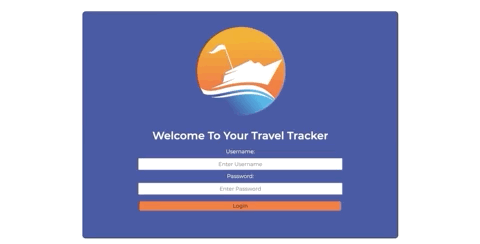

# Travel Tracker!

## Contributors
- [Nathan Darrington](https://github.com/npdarrington)

## Abstract
Travel Tracker is a website where a traveler can login to view their Travel Tracker dashboard. They can view their past trips, current trips, upcoming trips and pending trips that have yet to be approved by the travel agency. They can book a new trip from a variety of destinations and see while they are booking their trip how much the value of their selections will be! They can also refer to their YTD total for this year (2020) at the top right hand corner of the screen.

In this project, I started fresh with a webpack start kit repo and built all of the functionality from scratch. Includes a robust testing suite, fetching and posting to an API, SCSS, Accessibility for all users and custom error handling understandable for a user.

### App in Action



## Setup & Installation
To view and use the application, clone down [this repository](https://github.com/npdarrington/travel-tracker) and install with npm.
```
git clone git@github.com:npdarrington/Whats-Cookin.git
npm install
```
To view the test suite:
```
npm test
```

To open server for local viewing:
```
npm start
```
## Skills
- OOP using ES6 classes
- Array iterator methods/Object methods
- Test Driven Development - designing an application by testing first and pseudo-coding before coding functionality
- Accessibility - following ARIA guidelines to provide seamless tabbing for screen readers and choosing a color scheme that accommodates for colorblindness
- Workflow with a selected partner to review and merge 2 PR's as well as a special branch for accessibility testing.
- Code base efficiency by following SRP and DRY principles and using newer technologies

## Technologies Used
- Vanilla JS
- ES6 JS
- HTML
- CSS/SASS
- Webpack
- Mocha framework
- NPM
- Fetch API to GET/POST data to a server
- GitHub/Git
- Eslint
- moment.js for time/date formatting

## Wins & Challenges

### Challenges
- Deciding how to structure the UI to let the user have a fun, intuitive and easy to use experience without a lot of bloat while waiting for API fetch calls.
- Using API data that can be modified by multiple developers (both within our group and other students in the class). We're all learning how to use API data for the first time, so data was sometimes altered in ways that might not work with how our class methods were written.
- Deciding when something can be placed with a separate `domUpate.js` file or when it has to be referenced inside webpack entry point file (`index.js` for this project).

### Wins
- Tackling complicated logic involving multiple datasets.
- Diving more into SCSS and learning how to really use mixins and media queries to a higher efficiency.
- Completing booking a trip while blindfolder relying on only the screen reading and keyboard accessibility!
- Focusing more on writing efficent and reusable JS as opposed to fully rushing to get all of the features pushed out.

### Extended To-Do List
- Add a travel agent login where a travel agent can login with special privileges.
- Allow a travel agent to approve, modify and delete trips.
- Search for any user by name and view their YTD spending total for multiple years.
- Allows travelers to select other travelers in the API as reference for multiple travelers on a trip.
- DOM testing with chai spies for more practice.

## Additional Links
- [Project Board](https://github.com/npdarrington/travel-tracker/projects/1)
- [Original Project Specs](https://frontend.turing.io/projects/travel-tracker.html)
